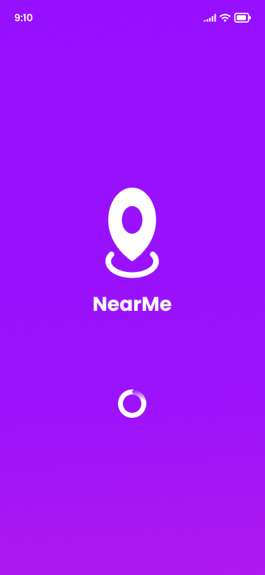
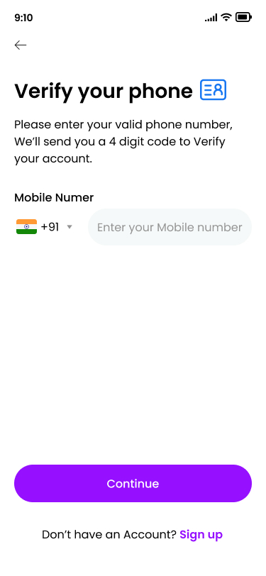
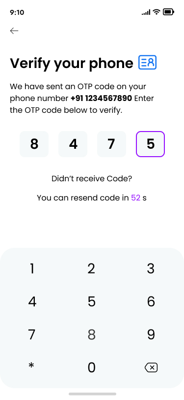
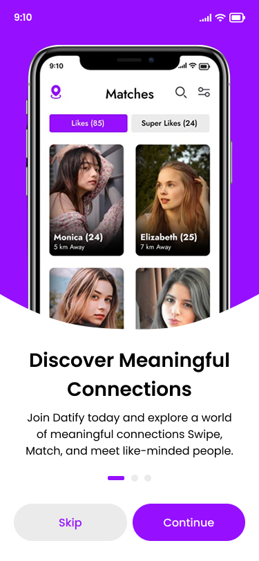
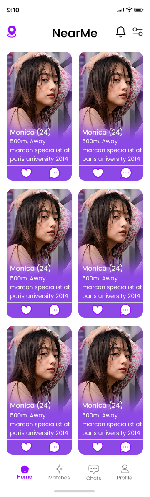
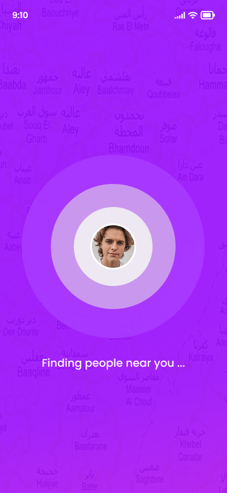
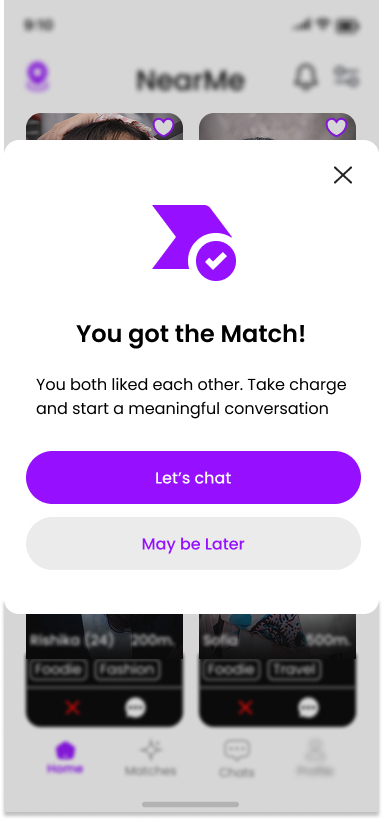
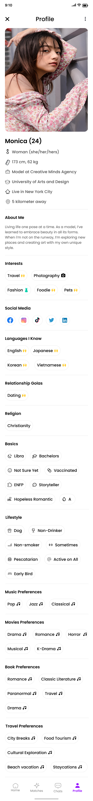
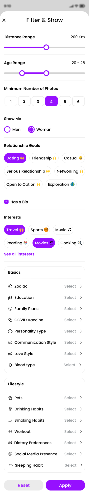

# 📍 NearMe - Proximity-Based Dating App

<div align="center">
  

**Connect with people around you in real-time**

[](https://android.com)
[](https://kotlinlang.org)
[](https://firebase.google.com)
[](LICENSE)
</div>

## 🌟 About NearMe

NearMe is a revolutionary proximity-based dating app that connects people who are physically near each other. Unlike traditional dating apps, NearMe focuses on real-time, location-based connections to facilitate spontaneous meetings and genuine interactions.

### ✨ Key Features

- **🎯 Real-Time Proximity Matching** - Discover people within 100 meters of your location
- **💬 Instant Messaging** - Chat with your matches in real-time
- **🔐 Phone Verification** - Secure authentication with OTP verification
- **📱 Smart Notifications** - Get notified when someone interesting is nearby
- **🎨 Beautiful UI** - Modern, intuitive design with smooth animations
- **🔒 Privacy First** - Your exact location is never shared, only proximity
- **⚡ Real-Time Updates** - Live location tracking for active connections

## 📱 Screenshots

<div align="center">
  <table>
    <tr>
      <td align="center">
        
        <br/><sub><b>Splash Screen</b></sub>
      </td>
      <td align="center">
        
        <br/><sub><b>Phone Verification</b></sub>
      </td>
      <td align="center">
        
        <br/><sub><b>OTP Verification</b></sub>
      </td>
    </tr>
    <tr>
      <td align="center">
        
        <br/><sub><b>Onboarding</b></sub>
      </td>
      <td align="center">
        
        <br/><sub><b>Discover People</b></sub>
      </td>
      <td align="center">
        
        <br/><sub><b>Finding Nearby</b></sub>
      </td>
    </tr>
    <tr>
      <td align="center">
        
        <br/><sub><b>You Got a Match!</b></sub>
      </td>
      <td align="center">
        
        <br/><sub><b>User Profile</b></sub>
      </td>
      <td align="center">
        
        <br/><sub><b>Smart Filters</b></sub>
      </td>
    </tr>
  </table>
</div>

## 🛠️ Tech Stack

### Frontend
- **Language**: Kotlin
- **UI Framework**: Android XML + Material Design
- **Architecture**: MVVM (Model-View-ViewModel)
- **Dependency Injection**: Hilt/Dagger
- **Image Loading**: Glide
- **Location Services**: Google Play Services Location API

### Backend
- **Database**: Firebase Firestore
- **Authentication**: Firebase Auth (Phone Number)
- **Cloud Storage**: Firebase Storage
- **Push Notifications**: Firebase Cloud Messaging
- **Analytics**: Firebase Analytics
- **Cloud Functions**: Firebase Functions

### Libraries & Dependencies
```kotlin
// Core Android
implementation "androidx.core:core-ktx:1.12.0"
implementation "androidx.appcompat:appcompat:1.6.1"
implementation "com.google.android.material:material:1.11.0"

// Architecture Components
implementation "androidx.lifecycle:lifecycle-viewmodel-ktx:2.7.0"
implementation "androidx.lifecycle:lifecycle-livedata-ktx:2.7.0"
implementation "androidx.navigation:navigation-fragment-ktx:2.7.6"
```

## 🚀 Getting Started

### Prerequisites
- Android Studio Arctic Fox or newer
- Android SDK 24+ (Android 7.0)
- Firebase project setup
- Google Services configuration

### Installation

1. **Clone the repository**
   ```bash
   git clone https://github.com/aatmikarm/NearMe.git
   cd NearMe
   ```

2. **Firebase Setup**
    - Create a new Firebase project
    - Enable Authentication, Firestore, Storage, and Cloud Messaging
    - Download `google-services.json` and place it in the `app/` directory

3. **Configure Signing**
    - Create `keystore.properties` file from the template
    - Add your keystore details

4. **Build and Run**
   ```bash
   ./gradlew assembleDebug
   ```

### 📋 Setup Checklist

- [ ] Clone repository
- [ ] Add `google-services.json` to `app/` folder
- [ ] Configure `keystore.properties`
- [ ] Sync project with Gradle files
- [ ] Build and run on device/emulator

## 🏗️ Project Structure

```
app/
├── src/main/java/com/aatmik/nearme/
│   ├── di/                 # Dependency injection modules
│   ├── model/              # Data models
│   ├── repository/         # Data repositories
│   ├── service/            # Background services
│   ├── ui/                 # UI components
│   │   ├── auth/           # Authentication screens
│   │   ├── main/           # Main activity
│   │   ├── nearby/         # Nearby users feature
│   │   ├── matches/        # Matches management
│   │   ├── messages/       # Chat functionality
│   │   └── profile/        # User profile
│   └── util/               # Utility classes
├── src/main/res/           # Resources (layouts, drawables, etc.)
└── google-services.json    # Firebase configuration
```

## 🔧 Key Features Implementation

### Proximity Detection
```kotlin
// Real-time location tracking with battery optimization
class LocationService : Service() {
    private fun processLocationUpdate(location: Location) {
        val userLocation = UserLocation(
            userId = userId,
            latitude = location.latitude,
            longitude = location.longitude,
            geohash = GeoHashUtil.encode(location.latitude, location.longitude),
            timestamp = System.currentTimeMillis()
        )
        
        // Update location and check for nearby users
        locationRepository.updateUserLocation(userLocation)
        checkProximity(userLocation)
    }
}
```

### Smart Matching Algorithm
```kotlin
```

## 📐 Architecture

The app follows **MVVM (Model-View-ViewModel)** architecture pattern:

- **Model**: Data classes and repositories
- **View**: Activities, Fragments, and XML layouts
- **ViewModel**: Business logic and UI state management

### Data Flow
```
UI Layer (Activities/Fragments) 
    ↕️
ViewModel Layer (LiveData/StateFlow)
    ↕️  
Repository Layer (Local + Remote data)
    ↕️
Data Sources (Firebase, SharedPreferences)
```

## 🔒 Security & Privacy

- **Phone Number Verification**: Secure OTP-based authentication
- **Location Privacy**: Only proximity is shared, never exact coordinates
- **Data Encryption**: All sensitive data is encrypted in transit
- **User Control**: Users can control their visibility and privacy settings

## 🚀 Deployment

### Debug Build
```bash
./gradlew assembleDebug
```

### Release Build
```bash
./gradlew assembleRelease
```

### Firebase App Distribution
```bash
./gradlew appDistributionUploadRelease
```

## 🧪 Testing

### Unit Tests
```bash
./gradlew testDebugUnitTest
```

### Instrumentation Tests
```bash
./gradlew connectedAndroidTest
```

## 📈 Performance Optimizations

- **Battery Optimization**: Smart location tracking intervals
- **Memory Management**: Efficient image loading and caching
- **Network Optimization**: Batched Firestore operations
- **UI Performance**: RecyclerView optimizations and smooth animations

## 🤝 Contributing

We welcome contributions! Please follow these steps:

1. Fork the repository
2. Create a feature branch (`git checkout -b feature/amazing-feature`)
3. Commit your changes (`git commit -m 'Add amazing feature'`)
4. Push to the branch (`git push origin feature/amazing-feature`)
5. Open a Pull Request

### Development Guidelines

- Follow Kotlin coding conventions
- Write meaningful commit messages
- Add unit tests for new features
- Update documentation as needed
- Test on multiple device sizes

## 🐛 Known Issues

- [ ] Occasional location service delays on some devices
- [ ] Push notification delivery issues on MIUI devices
- [ ] Battery optimization warnings on certain manufacturers

## 🗺️ Roadmap

### Version 2.0 (Upcoming)
- [ ] Group matching for friend groups
- [ ] Event-based matching (concerts, sports events)
- [ ] Video chat integration
- [ ] AI-powered compatibility suggestions
- [ ] Dark mode support

### Version 2.1 (Future)
- [ ] Instagram integration for profile verification
- [ ] Advanced filtering options
- [ ] Premium subscription features
- [ ] Multi-language support

## 📄 License

This project is licensed under the MIT License - see the [LICENSE](LICENSE) file for details.

## 👥 Team

- **Aatmik** - Lead Developer & Founder
- **Preeti** - UI/UX Designer
- **Prakriti** - Android Developer

## 📞 Support

For support and questions:
- 📧 Email: support@nearme.app
- 🐛 Issues: [GitHub Issues](https://github.com/aatmikarm/NearMe/issues)
- 💬 Discussions: [GitHub Discussions](https://github.com/aatmikarm/NearMe/discussions)

## 🙏 Acknowledgments

- Firebase team for excellent backend services
- Google for location services and Material Design
- Kotlin team for the amazing programming language
- Open source community for libraries and tools

---

<div align="center">
  <p>Made with ❤️ by the NearMe Team</p>
  <p>
    <a href="https://github.com/aatmikarm/NearMe/stargazers">⭐ Star us on GitHub</a> |
    <a href="https://github.com/aatmikarm/NearMe/issues">🐛 Report Bug</a> |
    <a href="https://github.com/aatmikarm/NearMe/issues">💡 Request Feature</a>
  </p>
</div>